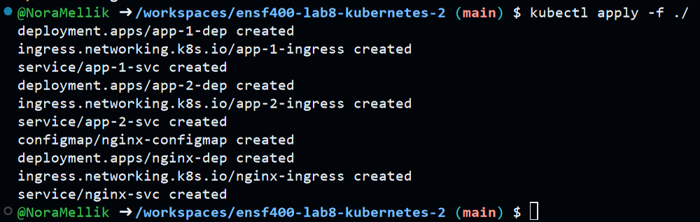
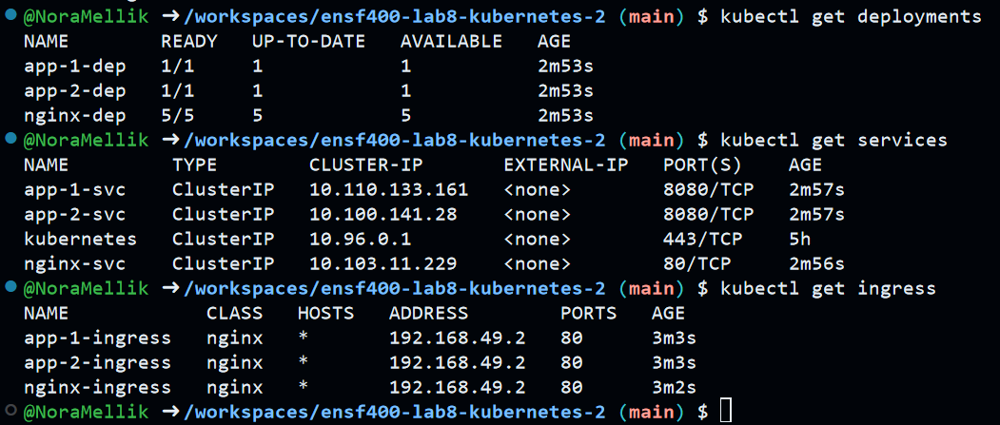
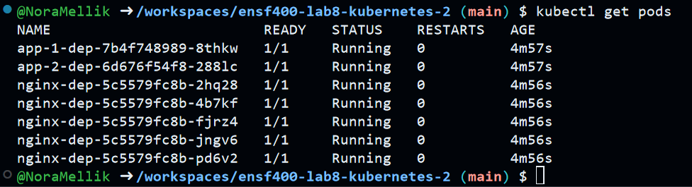
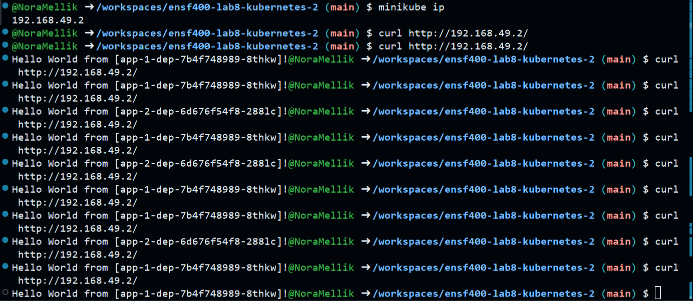

# Assignment 3 README - Nora Mellik

## Commands to run in order:
(stay and run in the root directory)

1. ```minikube start```
2. ```minikube addons enable ingress```
3. ```kubectl apply -f ./```

## Commands to check:
1. ```kubectl get deployments```
2. ```kubectl get services```
3. ```kubectl get ingress```
4. ```kubectl describe svc``` (for seeing ClusterIP)
5. ```kubectl get pods```

## Commands to run curl:
1. ```minikube ip```
2. ```curl http://192.168.49.2/```
(change ip if minikube ip is different) 

## Command to clear resources and close minikube:
1. ```kubectl delete -f .``` 
2. ```minikube stop```

## Outputs:

apply command:


get commands:




curl commands:

